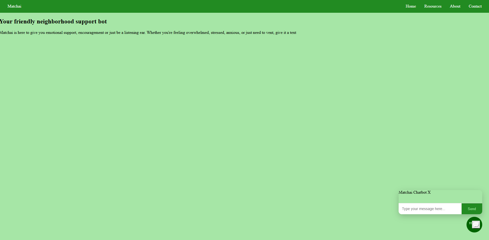
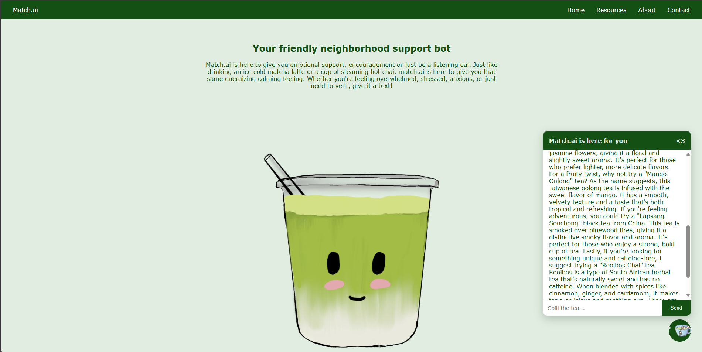

"https://www.youtube.com/watch?v=jeOfS90Flf8" - read me file tips a nd tricks 
"https://code.visualstudio.com/docs/languages/markdown" -  vsc markdown documentation 

# 📂 Project Title
Example: Matchai – Mental Health AI Chatbot

# 🚀 Overview
Brief description of what the project is and why you built it.
Example:

Matchai is a web-based mental health AI chatbot designed to provide emotional support, encouragement, and crisis detection. The chatbot uses both OpenAI and local LLM embeddings via Ollama for flexible deployment and a fully responsive user experience.

# 🛠️ Tech Stack
Frontend: HTML, CSS, JavaScript

Backend: FastAPI, Python

AI/NLP: LlamaIndex, Ollama (local LLMs), OpenAI API (optional version)

Other: Semantic Search, Session Memory

# ✨ Key Features
Responsive chat interface with real-time message handling

Local LLM integration using Ollama for offline capability

Crisis detection for mental health-related keywords

Session memory for personalized multi-turn conversations

Flexible API architecture supporting both cloud and local models

# 📸 Screenshots 

Version 1

Version 2 (Current Version) 
 

# 🗺️ Project Structure

├── backend/          # FastAPI server
├── frontend/         # HTML, CSS, JavaScript files
├── models/           # LLM and embedding configuration
├── README.md
└── requirements.txt  # Python dependencies

# 🛠️ Installation

## Clone the repository
git clone https://github.com/juveriaamin22/myProjects.git

## Navigate to the backend directory
cd backend

## Install backend dependencies
pip install -r requirements.txt

## Run Ollama locally
ollama serve

## Run FastAPI server
uvicorn main:app --reload

# 🌐 Usage
Open index.html in your browser.

Type a message to start chatting.

Click enter or select the send button. 

# 📚 Future Improvements 
Mobile responsiveness/make it cross platform.

Advanced sentiment analysis based on past behaviors. 

Cloud deployment with database support. 

Integration of cute matcha/chai/other teas pick me up mini games. 

# 🤝 Acknowledgments 
Inspired by mental health advocacy initiatives. I personally struggle with my mental health when I go through a rough patch and I know many of us do as well! I wanted to make a cute welcoming bot that you could go to to make yourself feel a little bit better. 

Built using FastAPI, LlamaIndex, and Ollama.